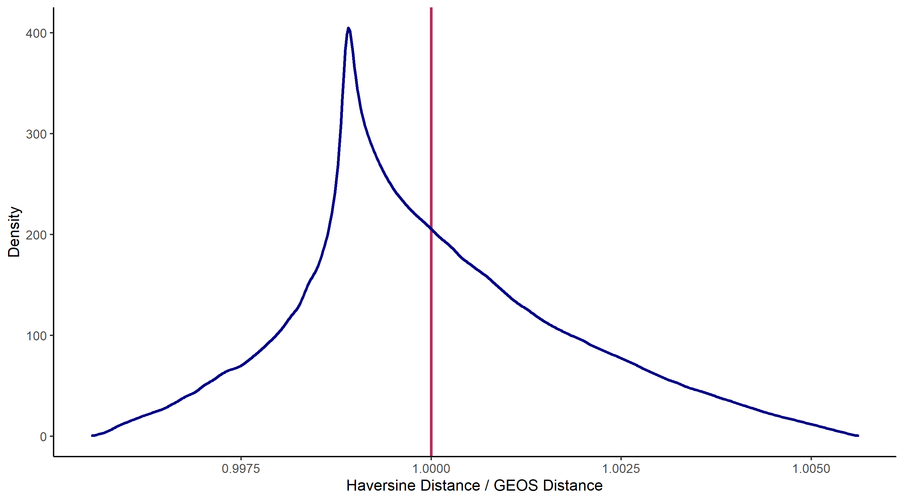
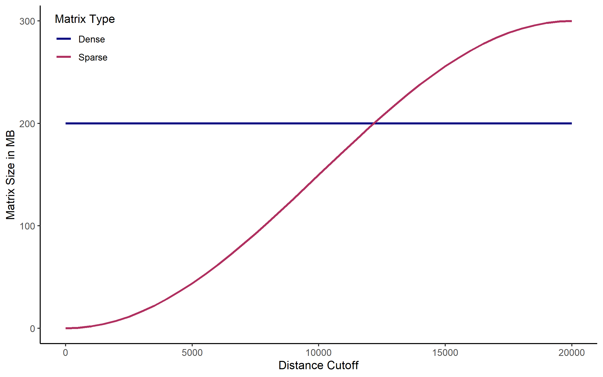
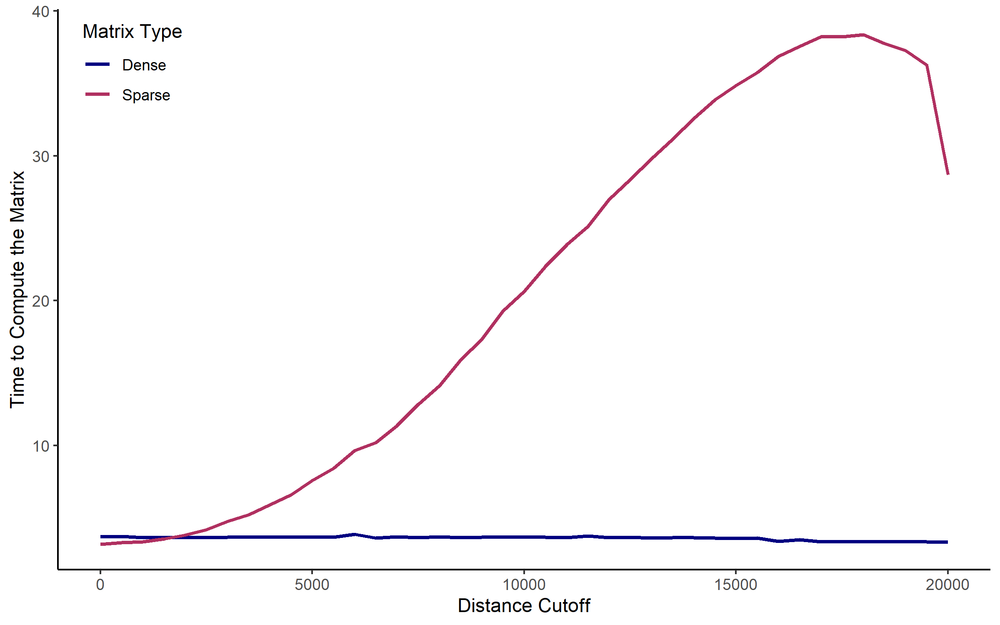
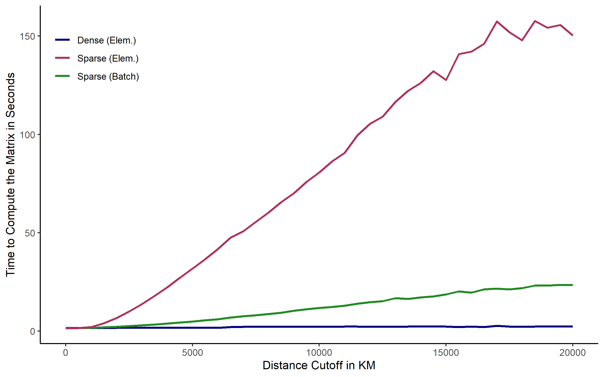
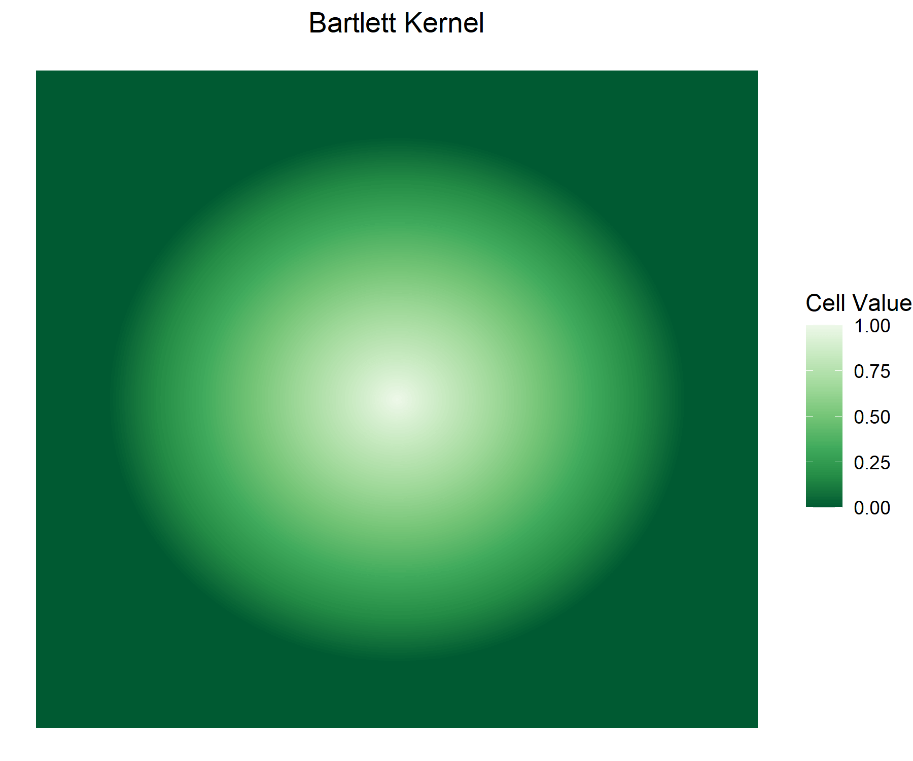
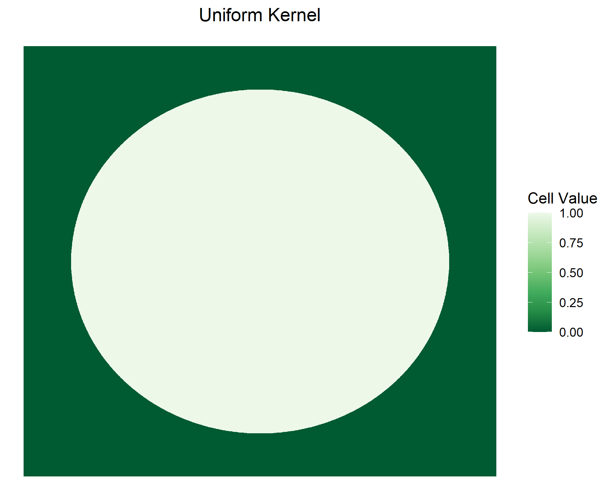

```{r, include = FALSE}
knitr::opts_chunk$set(
  collapse = TRUE,
  comment = "#>"
)
```

# Introduction
<p style="text-align: justify">Conley [-@Conley1999; -@Conley2008] standard errors account for spatial correlation in the data. Just like clustered standard errors consider observations not be independent of each other within groups, Conley standard errors recognizes potential dependence based on spatial proximity. As with other common standard error corrections, Conley standard errors do not require adjustments to the overall estimation strategy. They can be applied to an otherwise non-spatial model, such as OLS. The coefficient estimates remain untouched and non-spatial in that case and only the standard errors are adjusted.</p>

<p style="text-align: justify">Since @Conley1999 published his paper and [Stata code](https://economics.uwo.ca/people/conley_docs/code_to_download_gmm.html) on the proposed method, various other software implementations have been released, each building on earlier versions. Gradual modifications and extensions led to a growing number of functionalities and computational optimization over time. Among these earlier implementations are e.g. scripts and packages by (i) [Richard Bluhm](https://github.com/rbluhm/conley), (ii) [Luis Calderon and Leander Heldring](https://drive.google.com/file/d/1qrkA0tMDbvcOiShuoosFp0HC6V4fKjQN/view), (iii) [Darin Christensen and Thiemo Fetzer](https://github.com/darinchristensen/conley-se), (iv) [Fabrizio Colella, Rafael Lalive, Seyhun Orcan Sakalli, and Mathias Thoenig](https://acregstata.weebly.com/), and (v) [Solomon Hsiang](http://www.fight-entropy.com/2010/06/standard-error-adjustment-ols-for.html). The conleyreg package is the latest iteration of that process.</p>
<br>

# Distances
<p style="text-align: justify">All of the above mentioned implementations employ the original econometric method that Conley introduced more than two decades ago. And at least with OLS as accompanying estimation strategy, there is no stochastic component to this standard error correction. Nonetheless, results differ across implementations. The root of these discrepancies is the heterogeneity in distance estimations. Computing spatial distances between observations is key to deriving Conley standard errors. And implementations vary in multiple aspects of this step. The disparities range from a slightly different earth radius over alternative distance functions to unaligned definitions of space itself. Timothy Conley, Luis Calderon, and Leander Heldring do not restrict their functions to geographic space on Earth, but use a more abstract definition of space with an arbitrary number of dimensions and distance cutoffs delineating intervals along them. The flexibility of this abstract definition allows for a broader variety of applications, but comes with a number of drawbacks when applied to geographic space on Earth. It is somewhat restricted to planar projections, draws distance buffers in two-dimensional space as a rectangular box rather than a circle and faces a series of distortions and measurement errors arising from the planet's spherical nature. The other packages and scripts focus on geographic distances on Earth, and largely rely on the haversine equation. Haversine distances are not accurate down to the meter, but are faster than more complex alternatives. In `conleyreg`, you can choose between the faster Haversine function (`dist_comp = "fast"`) and more accurate alternatives computed via the GEOS or S2 libraries (`dist_comp = "precise"`).</p>

<p style="text-align: justify">This package is built on memory efficiency, speed, and flexibility regarding applications and user preferences. Deriving distance matrices is the most time consuming task in calculating Conley standard errors, sometimes taking multiple minutes. The remaining computations are a matter of seconds. `conleyreg`, therefore, offers a range of settings that allow you to customize distance estimations to your use case. The subsequent paragraphs guide you through the options and explain what they imply.</p>

<p style="text-align: justify">Let us begin by generating a sample of 5,000 random, globally distributed longlat points:</p>

```{r, eval = FALSE}
# Load packages
packs <- list("tidyverse", "sf", "conleyreg")
lapply(packs, require, character.only = TRUE)

# Generate 5,000 random longlat points
data <- rbind(c(-180, -90), c(180, -90), c(180, 90), c(-180, 90), c(-180, -90)) %>%
  list() %>%
  st_polygon() %>%
  st_sfc(crs = st_crs(4326)) %>%
  st_sf() %>%
  st_sample(5000) %>%
  st_sf()
```

<p style="text-align: justify">With 5,000 observations, there are 25 million bilateral distances linking each point to all other points and itself. To illustrate by how much these distances differ across `dist_comp` settings, we calculate them once with GEOS, which `conleyreg` does with `dist_comp = "precise"` while having the `sf` package set to `sf_use_s2(FALSE)`, and once with the haversine function, i.e. `dist_comp = "fast"` in `conleyreg`. Dividing the latter by the former produces the ratios displayed in the following figure:</p>

```{r, out.width = "98%", fig.align = "center", fig.cap = "Comparison of Haversine and GEOS Distances", echo = FALSE}


```

<p style="text-align: justify">The two methods do not produce identical results, but the differences are quite small - less than 0.25 percent for much of the distribution. Of course, the discrepancies might look different for applications other than this global example. Nonetheless, using the faster haversine distance function is often a good idea, especially when playing around with the data rather than generating a table meant for publication. The `s2` distances that are computed when `dist_comp = "precise"` and `sf_use_s2(TRUE)` turned out to even be identical to the haversine distances in this case.</p>

<p style="text-align: justify">The `fast` distance computations are, unlike the `precise` alternative, not outsourced to other packages. `conleyreg` directly implements them as C++ code which allows for a few more nuanced performance tweaks. One such feature is the use of sparse matrices. As the size of the distance matrix grows exponentially in the number of observations, it quickly surpasses your computer's memory limit. A data set of 50,000 points implies 2.5 billion matrix cells. This where sparse matrices come in handy. Instead of storing all cell values, they only store those that are not zero. Unless multiple points share a location, just $1/N$ of all cells in a distance matrix - those along the diagonal - are zero. However, `conleyreg` does not directly store distances in those cells. The package transforms distances into weights based on the specified distance cutoff and kernel. Only cells with distance below `dist_cutoff` are assigned a non-zero weight. If this radius is much smaller than the overall sample region, a vast majority of cells is set to zero - assuming an even distribution of points. In that case, a sparse matrix requires less RAM than a conventional dense matrix. Note that this advantage only holds with many zeros. Otherwise, sparse matrices can even be larger than their dense counterparts. We can illustrate the size differences using the above generated data and combined with various distance cutoffs and the below described bartlett kernel:</p>

```{r, out.width = "98%", fig.align = "center", fig.cap = "Dense and Sparse Matrix Sizes", echo = FALSE}


```

<p style="text-align: justify">The higher the distance cutoff is, the larger the sparse matrix becomes. At 15,000 km it is already substantially larger than the dense counterpart. We measure the size after the matrix was exported from C++ to R, turning the dense matrix into a regular matrix object and the sparse matrix into a dgCMatrix. The picture, however, also holds in the cross-sectional case where the package keeps the matrix in the C++ environment.</p>

<p style="text-align: justify">The obvious difference between sparse and dense matrices is their size, already implied by their names. What mainly motivates `conleyreg` to use dense matrices as default, though, is their speed. The employed C++ Armadillo library stores sparse matrices in a compressed format with column-major ordering. They are designed to occupy little memory, but it takes longer to manipulate them than is the case for dense matrices. Let us look at that disparity in the above used example. Again we compute all $N(N-1)/2$ unique bilateral distances and plug their transformed value into the matrix, if they are larger than the specified `dist_cutoff`. There are $N(N-1)/2$ rather than $N^2$ unique distances to be derived because the matrix is symmetric - point A is as far from point B as point B is from A - and because values along the diagonal - the distance between a point and itself - are zero (one after the bartlett transformation).</p>

```{r, out.width = "98%", fig.align = "center", fig.cap = "Speed of Dense and Sparse Matrix Manipulations", echo = FALSE}


```

<p style="text-align: justify">The higher the distance cutoff is, the more cells are modified. With a growing number of matrix accesses, sparse matrices become orders of magnitude slower than their dense counterparts.</p>

<p style="text-align: justify">There is a middle way that falls in between the two options in terms of both speed and memory use. Instead of directly inserting values into sparse matrices on an element-wise basis, we can store all to be inserted values and their target cell locations in intermediate objects and then insert them all at once. This is called batch insertion. You can activate it by setting `batch = TRUE`, conditional on already having sparse matrices activated via `dist_comp = "fast"` and `sparse = TRUE`. The use of intermediate object requires more space than it does to directly enter the values into the sparse matrix, but it also speeds up the process, as the following figure illustrates.</p>

```{r, out.width = "98%", fig.align = "center", fig.cap = "Speed of Element-Wise and Batch Insertion", echo = FALSE}


```

<p style="text-align: justify">Dense matrices are the fastest option in most cases. If your machine cannot allocate enough RAM to use them, sparse matrices with batch insertion may be a solution overcoming that barrier without sacrificing as much speed as sparse matrices with element-wise insertions would. Note that even computations taking 40 seconds, as denoted by the peak in the above figure, are still more than twice as fast as using the GEOS library with `dist_comp = "precise"` would be.</p>
<br>

# Kernels
<p style="text-align: justify">As discussed in the above section, the computationally costly part of `conleyreg` is setting up and modifying an N x N matrix that is based on bilateral distances. Because we do not actually enter the distances into that matrix, but transform them first, we can benefit from sparse matrices. Distances above `dist_cutoff` are set to zero and those below are modified according to one out of two kernels. You can choose between a bartlett kernel and a uniform kernel. The values they generate are essentially weights with which pixels within the specified radius enter subsequent calculations. With a bartlett kernel the weights gradually diminish with distance. With a uniform kernel all points within the radius are assigned an equal weight of one. The subsequent plots illustrate these weights at given distances from a centrally located point:</p>

```{r, out.width = "46%", fig.show = "hold", fig.align = "center", fig.cap = "Weights According to Different Kernels", echo = FALSE}



```

<p style="text-align: justify">The bartlett kernel is the default because it usually makes sense to assign a higher weight to nearer points than to points that are farther away. The uniform kernel does not implement a gradual transition but provides a computational advantage: it only produces zeros and ones. The respective C++ code stores them as short integers which only require a quarter of the RAM space that the data type used in the bartlett case does. This advantage especially plays out in cross-sectional application where the matrix is not exported to R in between. In the panel case, this advantage is somewhat diminished as the short integer data type does not exist in R and results are converted to regular integers.</p>
<br>

# Spatial Data Inputs
<p style="text-align: justify">The input data to `conleyreg` must be spatial points in `sf` format or in a non-spatial data frame format - including tibbles and data tables. The non-spatial format must provide longlat coordinates with longitudes between -180 and 180 and latitudes between -90 and 90. The names of the variables holding the coordinates must be passed to `lat` and `lon`. In the `sf` case, the package detects the geometry column automatically. `sf` points can use any CRS. Projections other than longlat employ Euclidean distances. Before you throw in any arbitrary non-longlat CRS, it is recommended to first check the extent to which it distorts distances. This is general GIS phenomenon and not specific to `conleyreg`. Local or equidistant projections can be a solution minimizing distance distortions.</p>
<br>

# Panel Applications
<p style="text-align: justify">`conleyreg` supports panels in the OLS case. You can run a panel estimation by passing the panel variables' names to `unit` and `time`. Estimations on a balanced panel of 100,000 observations with 10 time periods should be much faster than estimations on a cross-section of that size. The former calculates a distances matrix of 100 million cells given the 10,000 observations per period. The latter derives a distances matrix of 10 billion cells. Even in an unbalanced panel, where a distance matrix is calculated for each period rather than once, the cross-sectional matrix is still around ten times larger than all of the periods' matrices combined - assuming around 10,000 observations per period in the unbalanced case. In panel applications, `conleyreg` can correct for both spatial correlation and autocorrelation within units over time. To avoid errors, make sure to assign each unit a unique id. I.e. you must not reuse the id of a dropped out unit for another unit in a subsequent period. With `lag_cutoff` you can set the cutoff along the time dimension. The default is 0, meaning that standard errors are only adjusted cross-sectionally.</p>
<br>

# Estimation Equation
<p style="text-align: justify">The `formula` argument works like it does in many other packages. `y ~ x1 + x2` regresses variable `y` on variables `x1` and `x2`. `y ~ x1 + x2 | x3 + x4` adds variables `x3` and `x4` as fixed effects. Avoid data transformations inside the formula, e.g. `y ~ x1 + x1^2`. This might lead to incorrect results. Generate a new variable in the data instead: `mutate(data, x1_2 = x1^2)`. You can circumvent a permanent change in the data frame by performing the transformation inside `conleyreg`: `conleyreg(y ~ x1 + x1_2, data = mutate(data, x1_2 = x1^2), dist_cutoff = 1000)`.</p>
<br>

# Contributions
<p style="text-align: justify">Contributions to this package are highly welcome. You can submit them as a pull request to the ChristianDueben/conleyreg github repository or via e-mail to the package author. Apart from the code, your request should contain an explanation of what the code does and tests demonstrating the results' correctness.</p>
<br>

# References
